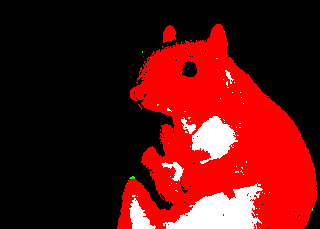
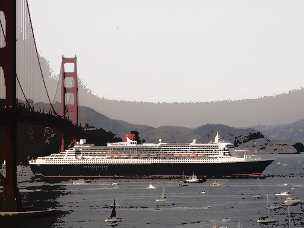
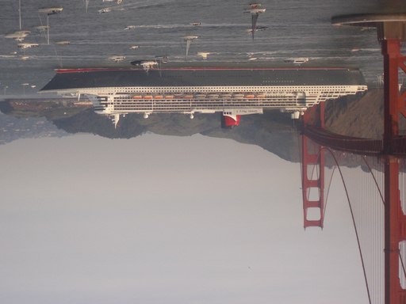
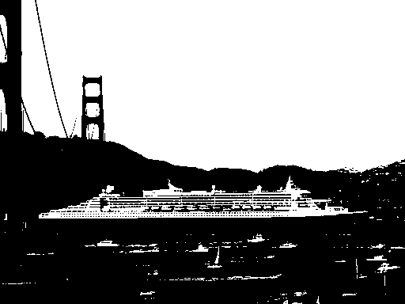
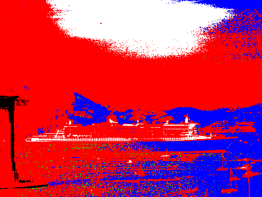

## OVERVIEW

The very first week of this class, you may recall that we did an activity in the Runestone Python book called _A Preview of the End Goal_ where you were immediately exposed to some seemingly complicated image processing code. At the time, you were told that although you may not be able to figure out what the code was doing at that point, that you would be able to do something like that by the end of the course. Well, now is the time to make that happen!  

For this C++ final project, you will create an image processing application that implements some of the functions we saw in that activity. That may sound complicated, but don't panic! Most of the algorithms you need are already provided to you in the Runestone book so your main job is going to be translating Python to C++ code, creating a simple user interface, and putting the pieces together to form a complete working image processing application.  

We will be giving you a set of specifications for the functions you need to implement and how your application should work, including the expected input and output behavior. However, it is completely up to you how you go about implementing and structuring your code as long as you meet the requirements of the project. We are intentionally leaving it somewhat open-ended so you have some flexibility with how you implement your code and have the creative freedom to change things or go further than what is expected. You can also just follow the instructions exactly as suggested if you prefer.  

For a quick refresher on the basics of image processing, please review section 7.8 on _Nested Iteration: Image Processing_ in the Runestone Python book. We will of course not be using the Python Image module mentioned there, but it provides a nice introduction to the image processing basics.  

The high-level summary of what you will be doing in this project is as follows:  

*   Implement the 10 image processing functions from the activity in the Runestone book (tip: Python version of the code provided in Runestone)
*   Implement a simple user interface for your application

As far as the minimum requirements for the project, that's about it! The rest of this page describes the details for these two parts, along with some additional information. Please read the entire project description before getting started.  

* * *

## DATA STRUCTURE (Informational)

In order to store the image data, we will need a data structure of some kind. An array might be a natural choice to hold the integer pixel information. However, there are limitations on using arrays in C++ as you have seen from the reading and assignments. In particular, a multi-dimensional array requires that all but the first dimension be specified at compile time if passing them as parameters. Since our application won't know the size of the image until the user specifies the image file they want to process, a standard C++ array might not be a good choice. Another issue with standard C++ arrays is that they are more difficult to work with when it comes to passing them as parameters, returning them as return values from functions, and memory management (e.g. forgetting to delete them if we dynamically create them using the new keyword).  

C++ vectors overcome a lot of these issues and are simpler to work with (please review section 6.7 in the Big C++ for more information on vectors). They do incur a little more overhead than arrays, but for our small application, this won't be an issue. One of the nice things about vectors for our application is that we can create a vector from inside of a function and pass the newly created vector back in a return value. We also don't have to pass around size information for vectors between functions like we do for arrays. Therefore, although you are not absolutely required to do so, we strongly recommend that you use a 2-dimensional vector to store your image data. The first dimension corresponds to the rows and the second dimension corresponds the columns. Each of the elements of the 2-dimensional vector will correspond to the pixel information (i.e. red, green, blue). You can think of it like a table in Excel with rows, columns, and with each of the cells containing 3 integer values to store the color information.  

In order to store each pixel, we will create a user-defined data type using a structure to hold the 3 color values (please review section 7.7 in the Big C++ for more information on structures). The members of the `Pixel` structure will be integer variables that will hold the `red`, `green`, and `blue` color values. The `Pixel` structure declaration should be as follows (already implemented for you in the starter code):

        struct Pixel
            {
                int red;
                int green;
                int blue;
            };

Therefore, our data structure will be a 2-dimensional vector of `Pixel` values (i.e. a vector of vectors of Pixels).  

To retrieve the number of rows (i.e. height) in the 2-dimensional vector, we can use the `size()` member function and to retrieve the number of columns (i.e. width), we can use the `size()` member function on the first row. For example:  

*   `int num_rows = image.size();  // Gets the number of rows (i.e. height) in a 2D vector named image`
*   `int num_columns = image[0].size();  // Gets the number of columns (i.e. width) in a 2D vector named image`

To define a new 2-dimensional vector of `Pixel` values and prepopulate it with a specified number of `rows `and `columns`, we could do the following:

    vector<vector<Pixel>> new_image(num_rows, vector<Pixel> (num_columns));

To write a single color value to one of the `Pixel`s in a 2-dimensional vector located at index `row` and `col`, we could do the following:

    new_image[row][col].red = 100; // Sets the red color to 100 for the Pixel located at index row, col

To read a single color value from one of the `Pixel`s in a 2-dimensional vector, located at index `row` and `col`, we could do the following:

    int green_color = image[row][col].green; // Gets the green color for the Pixel located at index row, col

Putting these ideas together, to iterate over all the rows and columns of a 2-dimensional vector and get the Pixel color values, we could use a nested for loop. We can also set new Pixel color values for a new 2-dimensional vector in the same iteration. For example:  

    for (int row = 0; row < num_rows; row++)
        {
            for (int col = 0; col < num_columns; col++)
            {
                // Get the blue color for the Pixel located at index row, col in the input 2D vector
                int blue_color = image[row][col].blue;
                ...
                ...
                // Set the blue color for the Pixel located at index row, col in a new 2D vector to 50
                new_image[row][col].blue = 50;
            }
        }

* * *

## READ/WRITE IMAGE FUNCTIONS (Provided to you)

We will be providing to you the functions to read and write BMP (bitmap) image files that you can use in your code.  

**READ IMAGE FUNCTION**  
The code for the `read_image` function was mostly derived from the Big C++ book in section 8.6 on _Random Access and Binary Files_. Please read chapter 8 on _Streams_ if you would like to understand how this function works or modify it in any way. We made a few modifications to the code in order to properly store the image in our 2-dimensional vector of `Pixel` values. The function accepts a `filename` of a BMP image as a parameter, reads in the BMP image, stores the pixel information in a 2-dimensional vector, and then returns the 2-dimensional vector. If the operation is not successful (e.g. the file is invalid), the function returns an empty vector.  

Function signature:

    vector<vector<Pixel>> read_image(string filename)

Example function invocation:

    vector<vector<Pixel>> image = read_image("sample.bmp");  // Read sample.bmp file and store in 2D vector named image

**WRITE IMAGE**  FUNCTION 

The code for the `write_image` function is a little more complicated and beyond the scope of this course. However, the basic idea is that the function accepts a `filename` and a 2-dimensional vector as parameters, writes the image data stored in the 2-dimensional vector to the BMP image file specified by the `filename` parameter, returns `true` if the operation was successful, and returns `false` if the operation failed. This will create a new BMP image file in the current working directory.   

Function signature:

    bool write_image(string new_filename, const vector<vector<Pixel>>& new_image)

Example function invocation:

    bool success = write_image("new_file.bmp", new_image);  // Write 2D vector named new_image to file named new_file.bmp

IMPORTANT NOTE: Your program is not allowed to modify or overwrite the original input image file! Therefore, be careful not to ever pass in the original filename into the write_image function.

**These two comments below only pertain to students who wish to understand or modify the read and write functions provided:** 

*   _BMP image files actually store their pixel data from bottom-to-top. This is in contrast to the way the Runestone book accesses image data and the way we intuitively might think of scanning an image, which would be from top-to-bottom. The read and write functions already account for this reversed access pattern so you shouldn't have to do anything special in your code. That is, you can assume that the 2-dimensional vector returned from the read function stores the pixels from top-to-bottom and that the write function assumes this same top-to-bottom pattern that is used in the Runestone book._

*   _Similarly, another small quirk with BMP image files is that they store their pixel values in the order of Blue, Green, and Red. This is in contrast to the way the Runestone book orders the colors, which is a Red, Green, Blue pattern. The read and write function already account for this reversed color order so you shouldn't have to do anything special in your code._

* * *

## IMAGE PROCESSING FUNCTIONS (To do)

Now that we can read and write the BMP image files, we are ready to move on to the image processing functions. Go back to the activity called _A Preview of the End Goal_ in the Runestone Python book and re-familiarize yourself with the project. In particular, review the code for the functions _process1_ up to _process10_. You can do that by going to the second activity on the page called _Activity 2 - ActiveCode (act_0_imageproc)_ and clicking on the _Show Code_ button. That will open the code window and display the Python code for all of the processes. Also, anytime you want to see how the function works, use the next activity titled _Activity 3 - ActiveCode (act_0_learnfuncs)_, change the process number function and parameters, and click on the _Save & Run_ button to see an example of the expected result.  

Your job is to implement those 10 process functions (_process1_ through _process10_) in C++. You are allowed to directly use the algorithms/code from the Runestone book for your project. Therefore, this shouldn't be very difficult of a task as you mainly just have to translate the code from Python to C++ for each of the functions below. In fact, you will find that once you get the first process function working, the rest of them will go very quickly since all of the functions follow the same pattern outlined below.  

For each of the image processing functions below, you will be:  

*   taking in the original image as a parameter, 
*   creating and initializing a new 2-dimensional vector to store the new image data,
*   iterating through the original image,
*   performing the requested image processing operation on the pixel values,
*   saving the modified pixel values to the new vector,
*   and returning the new vector

A description, recommended signature, and a sample output is provided for each of the functions below that you are required to implement for this project. Please refer to the activity in the Runestone book for more information on these process functions and for the code written in Python.  

Note: The "width" of the image refers to the number of pixels in the horizontal direction and that corresponds to the number of "columns". Similarly, the "height" of the image refers to the number of pixels in the vertical direction and that corresponds to the number of "rows". Also, to call one of your process functions from your main function and save the result to a new 2D vector, you can do something like this:  

    vector<vector<Pixel>> new_image = process_1(image);

### **PROCESS 1**

*   Description:

*   Adds vignette effect to image (dark corners)

*   Recommended function signature:

        vector<vector<Pixel>> process_1(const vector<vector<Pixel>>& image)

*   Sample output:

### **PROCESS 2**

*   Description:

*   Adds Clarendon effect to image (darks darker and lights lighter) by a scaling factor

*   Recommended function signature:

        vector<vector<Pixel>> process_2(const vector<vector<Pixel>>& image, double scaling_factor)

*   Sample output (with scaling_factor=0.3):

###   **PROCESS 3**

*   Description:

*   Grayscale image

*   Recommended function signature:

        vector<vector<Pixel>> process_3(const vector<vector<Pixel>>& image)

*   Sample output:

###   **PROCESS 4**

*   Description:

*   Rotates image by 90 degrees clockwise (not counter-clockwise)

*   Recommended function signature:

        vector<vector<Pixel>> process_4(const vector<vector<Pixel>>& image)

*   Sample output:

###   **PROCESS 5**

*   Description:

*   Rotates image by a specified number of multiples of 90 degrees clockwise

*   Recommended function signature:

        vector<vector<Pixel>> process_5(const vector<vector<Pixel>>& image, int number)

*   Sample output (with number=2):

###   **PROCESS 6**

*   Description:

*   Enlarges the image in the x and y direction

*   Recommended function signature:

        vector<vector<Pixel>> process_6(const vector<vector<Pixel>>& image, int x_scale, int y_scale)

*   Sample output (with x_scale=2 and y_scale=3):

###  **PROCESS 7**

*   Description:

*   Convert image to high contrast (black and white only)

*   Recommended function signature:

        vector<vector<Pixel>> process_7(const vector<vector<Pixel>>& image) 

*   Sample output:

###   **PROCESS 8**

*   Description:

*   Lightens image by a scaling factor

*   Recommended function signature:

        vector<vector<Pixel>> process_8(const vector<vector<Pixel>>& image, double scaling_factor) 

*   Sample output (with scaling_factor=0.5):

###   **PROCESS 9**

*   Description:

*   Darkens image by a scaling factor

*   Recommended function signature:

        vector<vector<Pixel>> process_9(const vector<vector<Pixel>>& image, double scaling_factor)  

*   Sample output (with scaling_factor=0.5):

###   **PROCESS 10**

*   Description:

*   Converts image to only black, white, red, blue, and green

*   Recommended function signature:

        vector<vector<Pixel>> process_10(const vector<vector<Pixel>>& image)

*   Sample output:

* * *

### USER INTERFACE (To do)

We want you to create a user interface that gives the user the ability to interact with your program. The requirements for the user interface are as follows:  

*   User can enter an input BMP filename

    *   This is the image file that the operations will be performed on

*   Displays a menu of available selections to the user

    *   One selection to change the input image if desired
    *   One for each of the image processing functions

*   User can enter their desired operation / menu selection
*   User can enter the desired output BMP filename

    *   This is the file where the modified image will be saved to
    *   Remember to never specify the original input BMP filename or else it will be overwritten!

*   User can enter the necessary parameters for the selected operation
    *   For example: scaling factor, number of rotations, etc.
    *   This applies to processes 2, 5, 6, 8, 9

*   Displays confirmation that the operation was successful
    *   Or an error message if the operation failed

*   User is brought back to the main menu after each operation so they can continue performing operations until they chose to exit out of the program

    *   It is very important that your program continues to accept user input until they explicitly signal they want to exit
    *   _Hint: You should use a while loop for your menu system_

*   User can gracefully exit out of the program

Below is an example input/output session showing how your user interface might look and operate. The text within the back quotes (`) represents the user input and the remainder of the text is the output from your program. Please note that your user interface does not have to match exactly with the one shown below. That is, your wording, order, look and feel, and layout can differ as long as you still meet the requirements outlined above. You may even want to improve upon what's shown below by making your user interface look nicer, giving better feedback to the user, performing user input validation, etc. However, you are not required to do so.  

<pre>
$ `./main`

CSPB 1300 Image Processing Application
Enter input BMP filename: `sample.bmp`

IMAGE PROCESSING MENU
0) Change image (current: sample.bmp)
1) Vignette
2) Clarendon
3) Grayscale
4) Rotate 90 degrees
5) Rotate multiple 90 degrees
6) Enlarge
7) High contrast
8) Lighten
9) Darken
10) Black, white, red, green, blue

Enter menu selection (Q to quit): `1`

Vignette selected
Enter output BMP filename: `process1.bmp`
Successfully applied vignette!

IMAGE PROCESSING MENU
0) Change image (current: sample.bmp)
1) Vignette
2) Clarendon
3) Grayscale
4) Rotate 90 degrees
5) Rotate multiple 90 degrees
6) Enlarge
7) High contrast
8) Lighten
9) Darken
10) Black, white, red, green, blue

Enter menu selection (Q to quit): `2`

Clarendon selected
Enter output BMP filename: `process2.bmp`
Enter scaling factor: `0.3`
Successfully applied clarendon!

IMAGE PROCESSING MENU
0) Change image (current: sample.bmp)
1) Vignette
2) Clarendon
3) Grayscale
4) Rotate 90 degrees
5) Rotate multiple 90 degrees
6) Enlarge
7) High contrast
8) Lighten
9) Darken
10) Black, white, red, green, blue

Enter menu selection (Q to quit): `3`

Grayscale selected
Enter output BMP filename: `process3.bmp`
Successfully applied grayscale!

IMAGE PROCESSING MENU
0) Change image (current: sample.bmp)
1) Vignette
2) Clarendon
3) Grayscale
4) Rotate 90 degrees
5) Rotate multiple 90 degrees
6) Enlarge
7) High contrast
8) Lighten
9) Darken
10) Black, white, red, green, blue

Enter menu selection (Q to quit): `4`

Rotate 90 degrees selected
Enter output BMP filename: `process4.bmp`
Successfully applied 90 degree rotation!

IMAGE PROCESSING MENU
0) Change image (current: sample.bmp)
1) Vignette
2) Clarendon
3) Grayscale
4) Rotate 90 degrees
5) Rotate multiple 90 degrees
6) Enlarge
7) High contrast
8) Lighten
9) Darken
10) Black, white, red, green, blue

Enter menu selection (Q to quit): `5`

Rotate multiple 90 degrees selected
Enter output BMP filename: `process5.bmp`
Enter number of 90 degree rotations: `2`
Successfully applied multiple 90 degree rotations!

IMAGE PROCESSING MENU
0) Change image (current: sample.bmp)
1) Vignette
2) Clarendon
3) Grayscale
4) Rotate 90 degrees
5) Rotate multiple 90 degrees
6) Enlarge
7) High contrast
8) Lighten
9) Darken
10) Black, white, red, green, blue

Enter menu selection (Q to quit): `6`

Enlarge selected
Enter output BMP filename: `process6.bmp`
Enter X scale: `2`
Enter Y scale: `3`
Successfully enlarged!

IMAGE PROCESSING MENU
0) Change image (current: sample.bmp)
1) Vignette
2) Clarendon
3) Grayscale
4) Rotate 90 degrees
5) Rotate multiple 90 degrees
6) Enlarge
7) High contrast
8) Lighten
9) Darken
10) Black, white, red, green, blue

Enter menu selection (Q to quit): `7`

High contrast selected
Enter output BMP filename: `process7.bmp`
Successfully applied high contrast!

IMAGE PROCESSING MENU
0) Change image (current: sample.bmp)
1) Vignette
2) Clarendon
3) Grayscale
4) Rotate 90 degrees
5) Rotate multiple 90 degrees
6) Enlarge
7) High contrast
8) Lighten
9) Darken
10) Black, white, red, green, blue

Enter menu selection (Q to quit): `8`

Lighten selected
Enter output BMP filename: `process8.bmp`
Enter scaling factor: `0.5`
Successfully lightened!

IMAGE PROCESSING MENU
0) Change image (current: sample.bmp)
1) Vignette
2) Clarendon
3) Grayscale
4) Rotate 90 degrees
5) Rotate multiple 90 degrees
6) Enlarge
7) High contrast
8) Lighten
9) Darken
10) Black, white, red, green, blue

Enter menu selection (Q to quit): `9`

Darken selected
Enter output BMP filename: `process9.bmp`
Enter scaling factor: `0.5`
Successfully darkened!

IMAGE PROCESSING MENU
0) Change image (current: sample.bmp)
1) Vignette
2) Clarendon
3) Grayscale
4) Rotate 90 degrees
5) Rotate multiple 90 degrees
6) Enlarge
7) High contrast
8) Lighten
9) Darken
10) Black, white, red, green, blue

Enter menu selection (Q to quit): `10`

Black, white, red, green, blue selected
Enter output BMP filename: `process10.bmp`
Successfully applied black, white, red, green, blue filter!

IMAGE PROCESSING MENU
0) Change image (current: sample.bmp)
1) Vignette
2) Clarendon
3) Grayscale
4) Rotate 90 degrees
5) Rotate multiple 90 degrees
6) Enlarge
7) High contrast
8) Lighten
9) Darken
10) Black, white, red, green, blue

Enter menu selection (Q to quit): `0`

Change image selected
Enter new input BMP filename: : `sample2.bmp`
Successfully changed input image!

IMAGE PROCESSING MENU
0) Change image (current: sample2.bmp)
1) Vignette
2) Clarendon
3) Grayscale
4) Rotate 90 degrees
5) Rotate multiple 90 degrees
6) Enlarge
7) High contrast
8) Lighten
9) Darken
10) Black, white, red, green, blue

Enter menu selection (Q to quit): `1`

Vignette selected
Enter output BMP filename: `process1_2.bmp`
Successfully applied vignette!

IMAGE PROCESSING MENU
0) Change image (current: sample2.bmp)
1) Vignette
2) Clarendon
3) Grayscale
4) Rotate 90 degrees
5) Rotate multiple 90 degrees
6) Enlarge
7) High contrast
8) Lighten
9) Darken
10) Black, white, red, green, blue

Enter menu selection (Q to quit): `Q`

Thank you for using my program!
Quitting...

$
</pre>
* * *

### ENHANCEMENTS (Optional, not graded)

If you would like an additional challenge, I encourage you to attempt to implement more advanced image processing functions. In the Runestone book in _Project 10: Image Processing_, they describe a couple of possible additional operations you can implement:  

*   Blending multiple images together
*   Rotating by an arbitrary angle
*   Smoothing/blurring
*   Edge detection

There are tons more out there! Feel free to do some research on other image processing functions. Or feel free to get creative and come up with your own unique image filter or operation!
