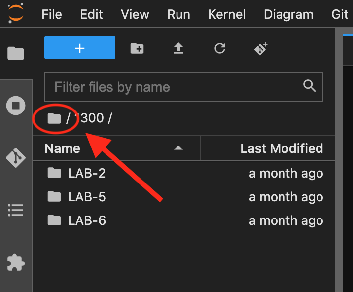
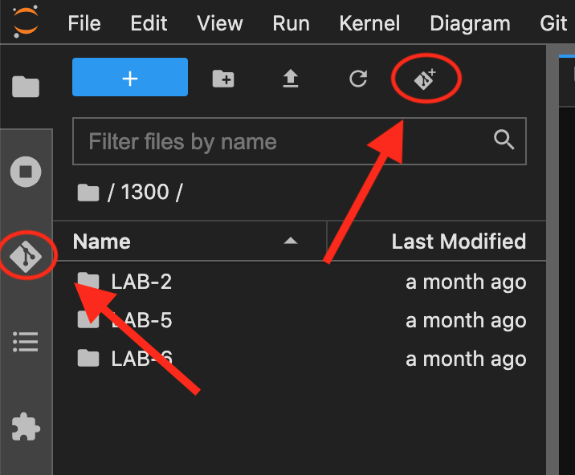
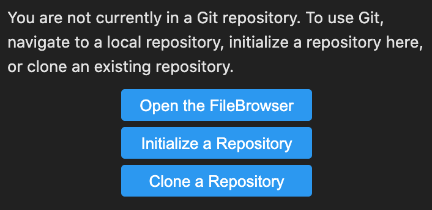
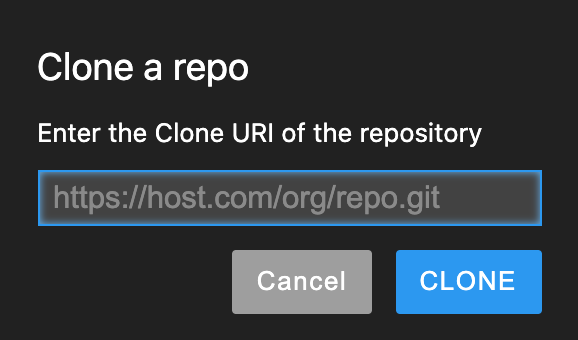
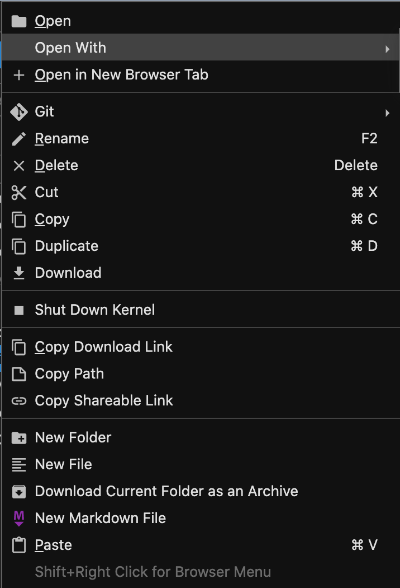
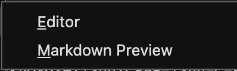

# CSPB-1300   C++ Final Project

This repository is a set of documents to be read before beginning your C++ Final Project. It also contains sample files and code to help you get started.
The link to the submission page for the project will be found in the final week's Moodle page (Week 16).

### For the C++ final project, you will be creating your own image processing application! 

Please read the information posted in this repository carefully before getting started. It contains everything you need to know about the project. 

The _Overview_ document describes the processes you need to code for the project.  The repository also contains 
starter files that are discussed in the _File Descriptions_ document and there are hints about the project in the _Getting Started_ document.  

There is also a _Test Debug_ document that contains some useful information on testing your functions.

1. To CLONE the repository, go to your JuypterHub CS1300 machine.  
2. Click on the folder icon in the current working directory  
to make sure you are in the top level directory for your notebook.

	

3. Click on the _Git_ icon  
in the toolbar on the left side of the window to see the GIT tools.  The icon in the with a plus sign in the icons at the top will directly to the request for the repository name.

	

4. Select _Clone a Repository_ from the list of tools.  Fill in the repository name with the URL for the _CSPB-1330-C-Final-Project_ repository at which you are currently looking   (GIT Project: https://github.com/CSCI-KNOX/CSPB-1300-C-Final-Project.git) and select _CLONE_. Once the cloning is complete you should have a folder _CSPB-1300-C-Final_Project_ listed in your directory and it should contain all of the files from the repository.

	       
  
5. Now let's view some of the documentation in the repository.  Select the folder icon and the _CSPB-1300-C-Final_Project_ directory to see the files in the newly cloned directory.
View the markdown files (\*.md) by right clicking on the file, select **_open with_** which will list two possible applications: ***Editor*** and ***Markdown Preview***.  Select the ***Markdown Preview*** to view the document.  Use the ***Editor*** to view the source of the document.

        

6. View the markdown preview for the *Overview*, the *File Descriptions*, the *Getting Started*, and the *Test Debug* markdown files.
7. Try building and running the sample code in *main.cpp* by using the command in ***File Descriptions***. 

